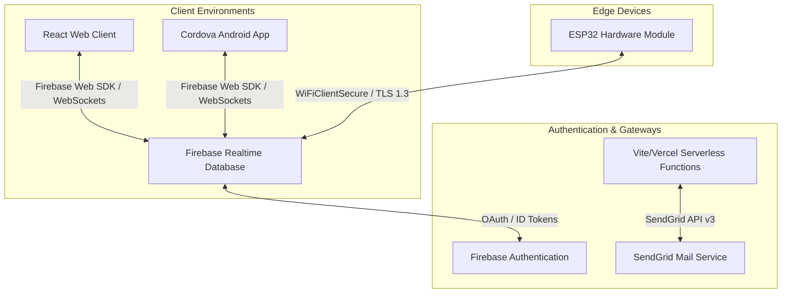

# Saltwater Electricity (iot-app) Project Architecture

This document outlines the architectural blueprint, data flows, integration patterns, and software quality protocols governing the `iot-app` system.

---

## 1. High-Level System Topology

The Saltwater Electricity platform is an IoT monitoring and management dashboard designed to analyze and control salinity, voltage, and power usage. It consists of three primary architectural components:

1.  **Frontend Dashboard (React 19 & Vite)**: Single Page Application (SPA) compiled to run as a web interface or wrapped in **Apache Cordova** for Android deployment.
2.  **Serverless Backend (Firebase)**: Authentication and Realtime Database (RTDB) providing live socket connections to telemetry and command routes.
3.  **Hardware Edge (ESP32)**: Microcontroller devices deployed in the field publishing sensor readings and receiving remote actuator commands.



---

## 2. Clean Architecture Layering

The application structure strictly separates UI presentation, business operations, and external services to ensure scalability, ease of modification, and testability.

```
┌────────────────────────────────────────────────────────┐
│                        UI Layer                        │
│         React Components (src/components, src/pages)   │
└───────────────────────────┬────────────────────────────┘
                            │ (Reads from / Triggers)
┌───────────────────────────▼────────────────────────────┐
│                        Hook Layer                      │
│             React Hooks (src/hooks/useReadings.js)     │
└───────────────────────────┬────────────────────────────┘
                            │ (Calls API logic)
┌───────────────────────────▼────────────────────────────┐
│                      Service Layer                     │
│          Firebase & Client APIs (src/services/)        │
└───────────────────────────┬────────────────────────────┘
                            │ (Integrates)
┌───────────────────────────▼────────────────────────────┐
│                   Infrastructure Layer                 │
│         Firebase RTDB, Authentication, LocalStorage    │
└────────────────────────────────────────────────────────┘
```

### Layer Breakdown
*   **UI Layer (`src/components/`, `src/pages/`, `src/layout/`)**: Contain purely presentational React components. They consume custom hooks to display real-time data and send user interactions downward. No direct database or API endpoints are imported in this layer.
*   **Context Layer (`src/context/`)**: Manages global application states (e.g., [AuthContext.jsx](file:///C:/Users/Admin/testcode/src/context/AuthContext.jsx) for security sessions, [UIContext.jsx](file:///C:/Users/Admin/testcode/src/context/UIContext.jsx) for navigation drawers/sidebars, and [NotificationContext.jsx](file:///C:/Users/Admin/testcode/src/context/NotificationContext.jsx) for alert queues).
*   **Hooks Layer (`src/hooks/`)**: Serves as the functional bridge. Custom hooks (e.g., [useTelemetry.js](file:///C:/Users/Admin/testcode/src/hooks/useReadings.js)) manage internal states, coordinate data updates, and clean up listeners on component unmount.
*   **Service Layer (`src/services/`)**: The exclusive location for Firebase SDK interactions, HTTP requests, and integrations. Every service file (e.g., [auth.service.js](file:///C:/Users/Admin/testcode/src/services/auth.service.js), [reading.service.js](file:///C:/Users/Admin/testcode/src/services/reading.service.js)) returns standardized response shapes or throws sanitized errors.
*   **Utility & Protocol Layer (`src/utils/`)**: Encapsulates common modules like the unified error handler (`appError.js`), secure logging wrappers (`logger.js`), and Role-Based Access Control logic (`rbac.js`).

---

## 3. Data Modeling & Database Schema (Firebase RTDB)

The system uses a NoSQL schema optimized for real-time synchronization, data integrity, and strict access controls.

### 📐 Structural Normalization Rule
Owner-device bindings **must** be stored in the `/device_assignments` node. The `/device_information` node remains reserved strictly for device specifications and online metadata. Tracking or resolving user ownership directly via `/device_information` is prohibited to prevent user metadata leakages.

### Node Structures

#### `/device_information`
Metadata of registered hardware modules.
```json
{
  "device_id_123": {
    "device_name": "Estuary Monitor Delta",
    "availability": "online",
    "specs": {
      "firmware_version": "v1.4.2",
      "model": "ESP32-WROOM-32D"
    }
  }
}
```

#### `/device_assignments`
Maps specific users (`uid`) to specific hardware identifiers (`device_id`).
```json
{
  "assignment_id_abc": {
    "uid": "user_uid_456",
    "device_id": "device_id_123",
    "assigned_by": "admin_uid_789",
    "assigned_at": 1782038400000
  }
}
```

#### `/readings` & `/logs`
Telemetry data. Every single telemetry write operation must enforce this exact structural schema:
```json
{
  "reading_id_xyz": {
    "device_id": "device_id_123",
    "tds_ppm": 320,
    "voltage": 3.32,
    "timestamp": 1782038450000
  }
}
```

#### `/audit-logs`
Administrative trace events. (Note: The legacy node `system_audit` is deprecated).
```json
{
  "log_id_999": {
    "timestamp": 1782038460000,
    "action": "USER_DISABLE",
    "adminEmail": "admin@saltwaterelectricity.com",
    "targetUid": "user_uid_456",
    "ipAddress": "192.168.1.100"
  }
}
```

---

## 4. Hardware Integration & Freshness Protocol

Edge devices (ESP32) publish readings and listen for action triggers (e.g., relays, resets) using atomic database streams.

### Secure Telemetry Transport
ESP32 devices must connect to the backend over WiFi utilizing `WiFiClientSecure` verifying the Firebase CA root certificate, enforcing **TLS 1.3** transport.

### 🛡️ Command Replay Defense
To protect hardware actuators from delayed or intercepted action commands, every transaction path command (e.g., relay toggle) must carry a `serverTimestamp`.
1.  The dashboard writes `{ "command": "TOGGLE_RELAY", "serverTimestamp": ServerValue.TIMESTAMP }` to the command node.
2.  The ESP32 reads the command and compares the `serverTimestamp` against its synchronized NTP time.
3.  **Mandatory Reject Rule**: If the timestamp differs from current NTP time by **more than 60 seconds**, the command must be ignored and discarded as a potential replay attack.

### Anti-Overwrite Writes
All hardware readings must update the database using **atomic multi-path updates**. This prevents race conditions, ensuring `/latest_reading` references remain in sync with long-term `/readings` nodes.

---

## 5. Security & Usability Protocols

To strictly meet software quality parameters (ISO 25010), the application applies two major internal communication protocols:

### A. Secure & User-Friendly Error Handling Protocol (SUEP)
System-level failures must never escape directly to the user interface. SUEP structures error flows as follows:

```
[Firebase/Axios Exception] 
       │
       ▼
[Service Catch Block] ────► Log original details to logger.error()
       │
       ▼
[Sanitization Utility] ──► Generate localized, non-technical appError payload
       │
       ▼
[UI Layer (Context)] ────► Render empathetic instruction (e.g., "Connection link failed...")
```

1.  **Strict Masking**: Specific credential errors (like "wrong-password" vs "user-not-found") are combined into a generic *"Invalid email or password"* notification to prevent account enumeration.
2.  **No Stack Traces**: UI elements never render database stack traces, SQL/NoSQL structure hints, or direct network failures.

### B. Enumeration Prevention Protocol (EPP)
To protect structural paths from client-side discovery:
1.  **Silent 404**: Attempts to access unauthorized routes (403 status) must redirect immediately to the standard `NotFound` page without altering the user's browser URL.
2.  **Conditional Router Mapping**: Administrative pages (such as `/admin/users` or `/admin/devices`) are completely omitted from the React Router tree if the current session role is not `ADMIN`.
3.  **Intrusion Alert**: Every time the `NotFound` component mounts under unauthorized routes, a `POTENTIAL_ENUMERATION` entry containing the target path is logged to `/audit-logs`.

---

## 6. Build & Packaging Pipeline (Vite + Cordova)

The codebase compiles to static web and hybrid mobile platforms from a single Vite configuration.

```
                      [npm run build]
                             │
                             ▼
              Checks VITE_BUILD_TARGET Env Var
                             │
              ┌──────────────┴──────────────┐
              │ (mobile)                    │ (web)
              ▼                             ▼
   Build Output Directory        Build Output Directory
../saltwaterelectricity/www              /dist
              │                             │
              ▼                             ▼
    [Cordova Android Build]        [Static Web Hosting]
```

### Output Redirection
The [vite.config.js](file:///C:/Users/Admin/testcode/vite.config.js) dynamically intercepts the build destination:
*   **Web Target**: Compiles output index assets to `/dist` (used for standard web deployments).
*   **Mobile Target**: Triggered using `npm run mobile-android` (which overrides `BUILD_TARGET=mobile`). Vite redirects output code directly to the sibling directory `../saltwaterelectricity/www`. Cordova then wraps this static distribution in an Android APK.

### Absolute vs. Relative Paths
Because Cordova applications run locally inside a browser-like Web View via the `file://` protocol, asset paths must be relative:
*   Vite config programmatically applies relative base rules for production releases:
    `base: command === "build" ? "./" : "/"`
*   This ensures all style, script, and image references resolve correctly on local Android file hosts.
